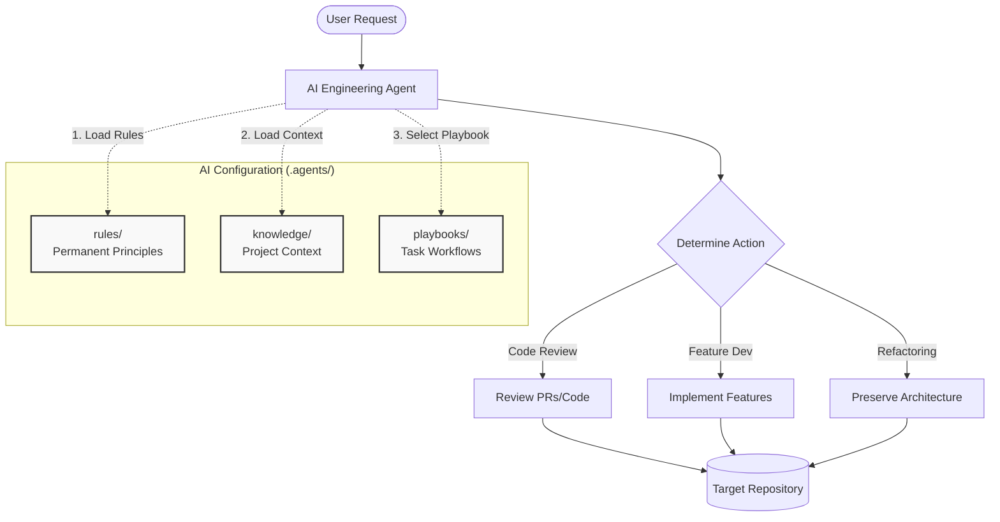
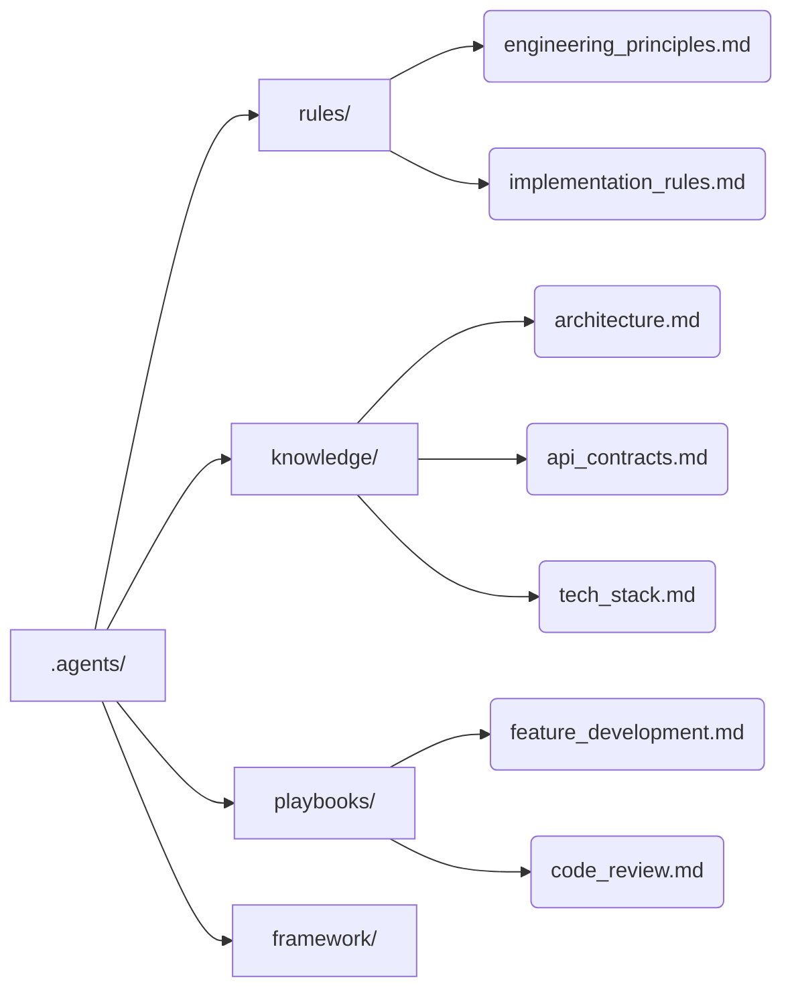

# AI Engineering Framework (ai-skill-rules)

A configuration framework providing rules, project context, and playbooks to guide AI agents in assisted software engineering workflows. 

This repository serves as the "brain" for an AI assistant, ensuring that all automated engineering tasks are consistent, context-aware, and aligned with your project's architectural standards.

## 🚀 Use Cases

- **AI-Assisted Feature Development**: Agents follow project-specific architecture and coding conventions to implement new features consistently, without re-inventing the wheel.
- **Automated Code Reviews**: Validate implementations and pull requests against predefined engineering principles, preventing architectural drift and technical debt.
- **Onboarding & Knowledge Retention**: Maintain project baseline and tech stack details so any new AI session (or human developer) starts with complete, up-to-date context.
- **Consistent Refactoring**: Apply minimal, focused changes that preserve existing behavior based on strict repository rules.

## 🧠 How It Works

At the beginning of every session, the AI agent indexes this repository to understand the rules and context before executing any tasks.

## 📂 Repository Structure

The framework is organized into specific directories within `.agents/` to separate permanent rules from project-specific context and dynamic workflows.

### Directory Details
- **`rules/`**: Permanent engineering principles and behavioral guidelines that the AI must *always* follow (e.g., "Minimize Change", "Preserve Existing Behavior").
- **`knowledge/`** (Project Context): Project-specific facts, including architecture, API contracts, coding conventions, and technology stack definitions.
- **`playbooks/`**: Task-specific step-by-step workflows (e.g., how to do a code review, how to develop a feature).
- **`framework/`**: Core definitions and changelogs for the AI configuration itself.

## 🛠 Getting Started

1. **Clone the repository** (or add the `.agents` folder to your existing codebase).
2. **Update the `knowledge/`** folder with your project's specific architecture, tech stack, and API contracts.
3. **Engage your AI Agent** and instruct it to "Read the `.agents/AGENTS.md` file to initialize your context."
4. **Start building!** The agent will now follow the customized playbooks and rules defined in this repository.
